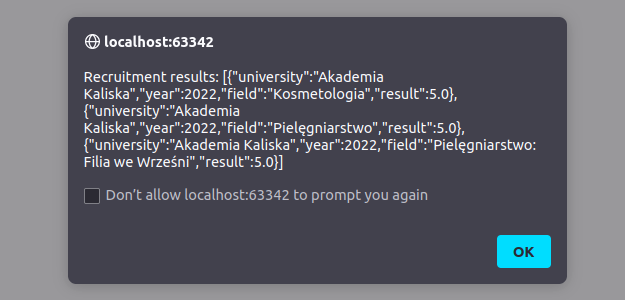

# Setup

```shell
# install Rust
> curl --proto '=https' --tlsv1.2 -sSf https://sh.rustup.rs | sh
# install `wasm-pack`
> cargo install wasm-pack
```

# Build
```shell
# first run will take a while (fetching Rust toolchain, crates etc.)
> wasm-pack build --target web --release
```

The command above will generate `pkg/` directory.
It contains:
 - `.gitignore`
 - `README.md`
 - `package.json`
 - `wasmatura.d.ts`
 - `wasmatura.js`
 - `wasmatura_bg.wasm`
 - `wasmatura_bg.wasm.d.ts`

# Usage

You can directly call into Wasm lib like shown in `index.html`:
```html
<script type="module">
  import init, { process } from "./pkg/wasmatura.js";
  
  init().then(() => {
    process("{\"chemistry_base\": 32, \"biology_adv\": 64}");
  });
</script>
```

If you host `index.html` locally, you should see something like:



# Size optimization
Currently, `wasmatura_bg.wasm` takes ~100KB.
It should be expected that this will grow linearly while adding further universities and formulas.
However, there are usually many ways for optimizing build size, see e.g. https://rustwasm.github.io/book/game-of-life/code-size.html#shrinking-wasm-size.
